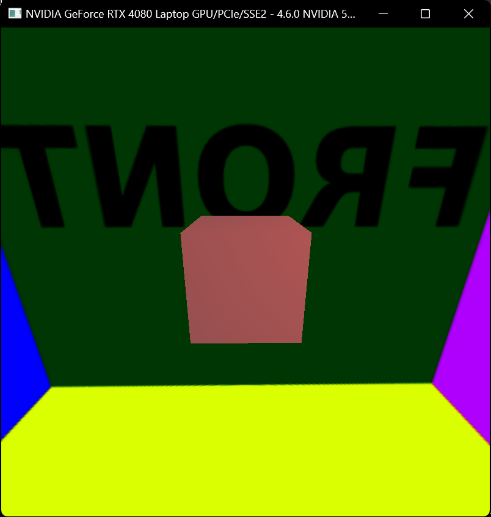
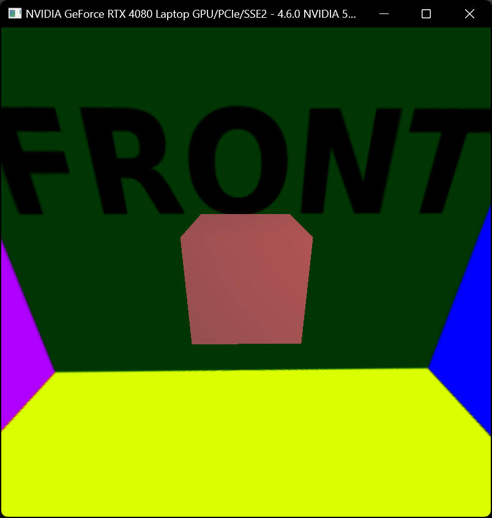
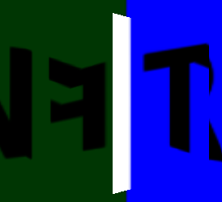
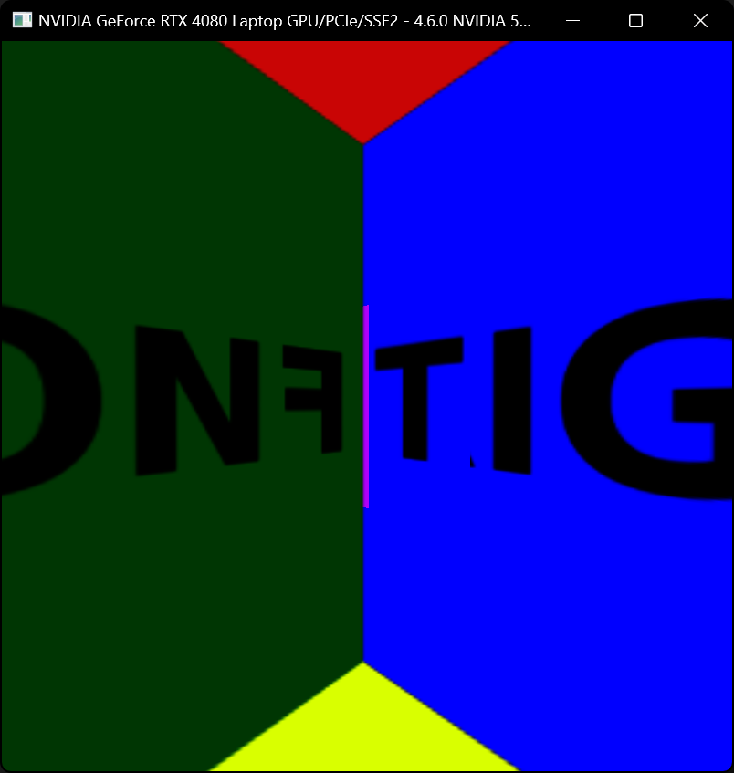
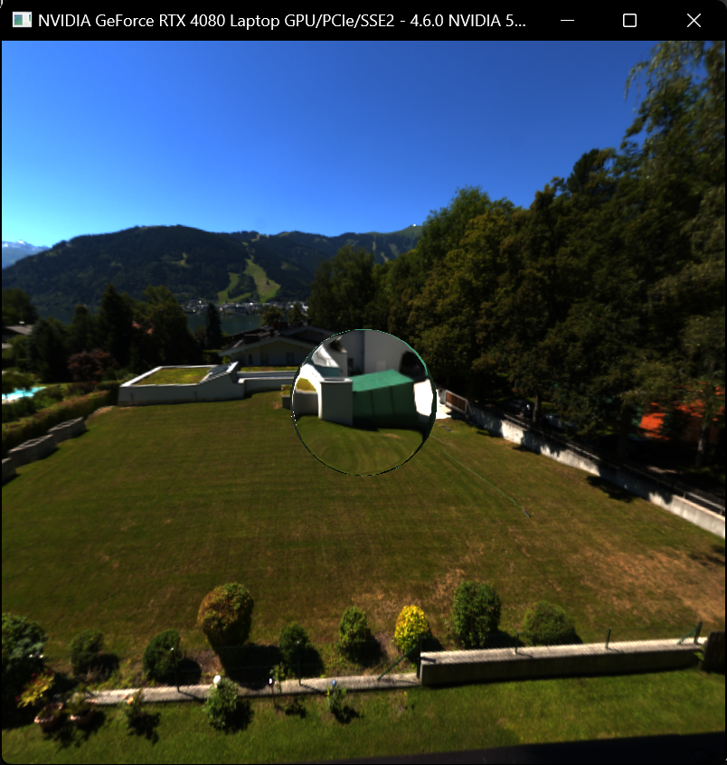
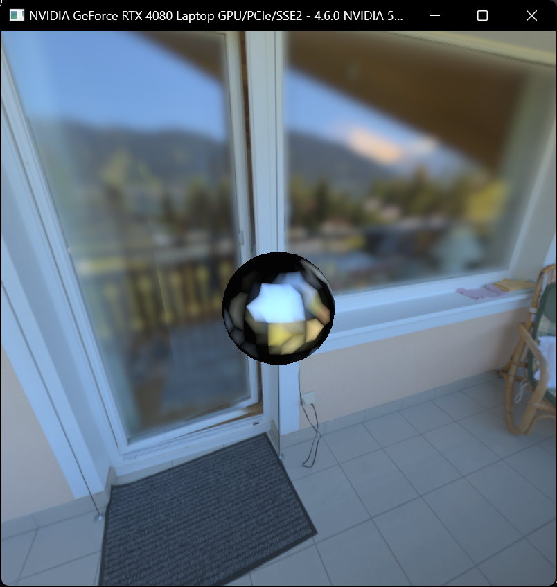
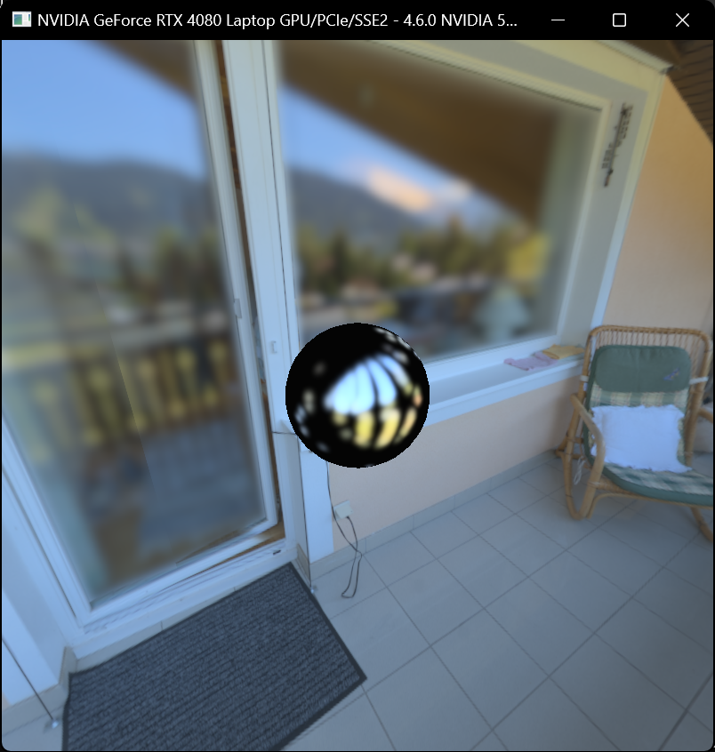

# Computer Graphics II - Environment Mapping & HDR Lighting
Final result video can be found at the bottom.

## Preparation
Something I wanted to do differently in this homework compared to the last one was about the starting code. The sampleGL code we were given was sufficient for small projects but I knew this one was going to be way more complex. So right off the bat 
I decided to do some refactoring in order to make things easier down the line. I defined a few classes in different files to increase the level of abstraction and avoid having to directly call OpenGL's often complicated and unintuitive function calls.
After that, I rendered my first cube and got to work on the homework tasks.

## Camera Control
First task I set my eyes on was making the camera orbit around the center object. I had already learned how to make a freelook camera from the website learnopengl.com before, so this was easy to implement. With a freelook camera you created a
direction vector and made the camera (placed at the origin) point in the same direction as it. With an orbiting camera, the direction vector becomes the position of the camera, and the camera looks at the origin.
So it's like the inverse of a freelook camera. Here's a code snippet from the mouse movement handling code I wrote:
```cpp
	Yaw += xoffset;
	Pitch -= yoffset;
	if (Pitch > 89.0f)
		Pitch = 89.0f;
	if (Pitch < -89.0)
		Pitch = -89.0f;
	glm::vec3 direction;
	direction.x = cos(glm::radians(Yaw)) * cos(glm::radians(Pitch));
	direction.y = sin(glm::radians(Pitch));
	direction.z = sin(glm::radians(Yaw)) * cos(glm::radians(Pitch));
	camPos = Distance * glm::normalize(direction);

	viewingMatrix = glm::lookAt(camPos, ORIGIN, UP);
```
Here xoffset and yoffset are calculated using the data from the mouse movement callback, Yaw and Pitch are the degrees between the direction vector and the +X axis and the XZ plane respectively. This means when yaw is 0 we actually look towards +X,
so we initialize it to 90 to look towards -Z. We also clamp Pitch between [-89,89] degrees so we dont cause the image to flip when we keep looking up or down. Here's the result:


Note that at this point I havent implemented any of the HW task shaders and Im using one of the shaders given in sampleGL.

## Skybox
Now that I could look around my scene as intended, I started working on the skybox next. In order to do this I followed the hw pdf and the lecture slides. I used a quad which I rendered 1 unit away from the "camera" with a 90 degree fov in both directions.
Rendering this quad passed its vertices to the vertex shader, which, after going through some transformations, would go to the fragment shader as interpolated directions, these directions are of course a perfect way to do mapping from the spherical HDR image
to the cubemap textures, so thats what I did. I created 6 rotation vectors to rotate these directions to the corresponding faces of the cubemap. After that it was just a matter of setting the rotation matrices and binding the cubemap textures to render to,
then we had a complete cubemap. Here's the fragment shader to initialize the cubemap, following the same steps as the lecture slides:
```glsl
in vec3 direction;
out vec4 FragColor;
uniform sampler2D hdrTexture;

void main() {
	float theta = atan(direction.y, sqrt(direction.x*direction.x + direction.z*direction.z));
	float phi = atan(direction.z, direction.x);
	vec2 uv;
	uv.x = (phi + PI) / (2.0 * PI);
	uv.y = (theta + PI / 2.0) / PI;
	FragColor = texture(hdrTexture, uv);
}
```
And in the fragment shader to render the skybox I just sampled from our cubemap texture instead of rendering to it:
```glsl
out vec4 FragColor;
in vec3 direction;
uniform mat4 skyboxRotation;

void main()
{
  FragColor = texture(skybox, newDirection); // This is not the final FS, just a part of it.
}
```
This is where I encountered my first real bug, I tested rendering the skybox with the Test.hdr image and all of the text on the skybox faces were backwards as if they had been mirrored.

<div style="display: flex;">
  
</div>

I didn't and still don't know why this happened. Could be due to the rotation matrices I used during my initialization of the cube map, or something else. Either way the fix was very simple, I just negated the x component of the direction I sampled from in
the vertex shader I used while rendering the skybox, and the image turned out fine.

<div style="display: flex;">
  
</div>

## Mirror and Glass
Implementing the median cut algorithm and passing directional lights to shaders looked like daunting tasks to me, so I wanted to do something easier first. Thus enters, the Mirror and Glass rendering modes. Implementing these were very simple, I copied the
vertex shader I used for rendering the skybox and added some necessary transformations and normal data. Then I added a simple reflect call for mirror mode and a refract call for the glass mode. The fragment shader was the same as the Skybox fragment shader,
I didn't need to change it because all I needed was to sample from the skybox, just from a different direction depending on the mesh normals. Doing the reflect and refract calls in the fragment shader might have been a better idea but the results looked good
(except for a bug) so I kept them as is.

The only bug I encountered was with mirror mode. When rendering a cube in mirror mode, the reflection on the cube's surface would make a sharp bend, I think this happened along the borders of the triangles making up
the face of the cube. In the image below, you can see the letter F and a small part of the letter T on the mirror being bent around the diagonal of the cube surface, though it is a bit hard to make out the cube itself.

<div style="display: flex;">
  
</div>

In the vertex shader I was normalizing the direction that would get passed to the fragment shader, deleting that line and passing the direction without normalizing somehow fixed the issue. If you have any idea why this might have happened, please do share.

<div style="display: flex;">
  
</div>

And also about the glass mode, in the HW video the glass mode inverted the scene behind it. I don't know what index ratio was used there but when I used a ratio of 1/1.52 (air to glass) it only created a "zoom in" effect similar to a magnifying glass.

<div style="display: flex;">
  
</div>

I didn't think this visual was wrong so I didn't change it, but an inverted look can be obtained with an index ratio of around 1/4. (Also the green artifacts you see around the sphere are barely visible during execution, if at all. So pls don't judge :) )

## Median Cut, Environment Mapping & Tone Mapping

The final part of the homework, except for a few small features. For environment mapping I precomputed the light regions by running the median cut algorithm on the scene's HDR image before doing any rendering, and stored them in an array of directional
light structures I defined:
```cpp
struct DirectionalLight {
	glm::vec3 direction;
	glm::vec3 color;
};
```
The median cut algorithm I wrote is a recursive one which takes the borders of a region as parameter, finds the centroid location and the region color value, then runs the algorithm again after dividing the region in two to generate the light regions for
the next level, up to level 7 or 128 lights. In order to make finding the centroid location easier, I also created a summed area table for both color values and luminance values, which is easy enough to do with a dynamic programming-like approach.
```cpp
void HDRTexture::init_sum_area_table() {
	ColorSumAreaTable.resize(Height);
	EnergySumAreaTable.resize(Height);
	for (int y = 0; y < Height; y++) {
		ColorSumAreaTable[y].resize(Width);
		EnergySumAreaTable[y].resize(Width);
	}

	float cosInc = abs(cos(find_inclination(0)));
	ColorSumAreaTable[0][0] = cosInc * glm::vec3(data[0], data[1], data[2]);
	for (int y = 1; y < Height; y++) {
		int index = y * Width * Channels; cosInc = abs(cos(find_inclination(y)));
		ColorSumAreaTable[y][0] = ColorSumAreaTable[y - 1][0] + cosInc * glm::vec3(data[index], data[index + 1], data[index + 2]);
	}
	for (int x = 1; x < Width; x++) {
		int index = x * Channels; cosInc = abs(cos(find_inclination(0)));
		ColorSumAreaTable[0][x] = ColorSumAreaTable[0][x - 1] + cosInc * glm::vec3(data[index], data[index + 1], data[index + 2]);
	}
	for (int y = 1; y < Height; y++) {
		cosInc = abs(cos(find_inclination(y)));
		for (int x = 1; x < Width; x++) {
			int index = y * Width * Channels + x * Channels;
			ColorSumAreaTable[y][x] = ColorSumAreaTable[y - 1][x] + ColorSumAreaTable[y][x - 1] - ColorSumAreaTable[y - 1][x - 1] + cosInc * glm::vec3(data[index], data[index + 1], data[index + 2]);
		}
	}

	for (int y = 0; y < Height; y++) {
		for (int x = 0; x < Width; x++) {
			EnergySumAreaTable[y][x] = 0.2126*ColorSumAreaTable[y][x].r + 0.7152*ColorSumAreaTable[y][x].g + 0.0722*ColorSumAreaTable[y][x].b;
		}
	}
}
```
Then while doing the rendering I would pass the lights belonging to the active median cut level as an array of uniforms to the shaders. I originally wanted to use UBOs, but I couldn't get them to work and I found it easier to use uniform arrays since the
maximum number of lights was determined to be 128 for the homework, meaning I only needed an array of size 128 which I hardcoded into the shaders and the rest of the code.

At this point I couldn't test if my environment mapping was done correctly because the color values from the lights became too high and the side of the mesh facing the lights would be rendered in full white, so after a bit of trying to check the lights I
decided to move on to tonemapping instead. I implemented that too, by following the lecture slides and the homework pdf. I rendered my skybox and my mesh (with logged color values) to an offscreen texture in a framebuffer, then sampled from
that texture to render to a full screen quad where I did my tonemapping. I then tested my code on lightprobe mode first, which I had written earlier, and the visual looked fine on the bright parts of the mesh, but when transitioning to the dark sides not
facing any light, the border was very jagged and full of sharp corners. So I wrote the disco mode shader and tested that too, where I encountered another fun bug:

<div style="display: flex;">
  
</div>

I had done the calculations for diffuse and specular shading in my vertex shaders, which caused the colors to be interpolated instead of the normals and vertex coordinates used to calculate them... Rookie mistake...

Well at least I got a funky looking disco ball out of it so that's fun.

Anyway I fixed this problem by moving my coloring calculations to the fragment shader, and everything looked fine.

<div style="display: flex;">
  
</div>

## Finishing touches
After all that I added the leftover, minor features. Rotation of the skybox independent of the camera, exposure configuration, glossy mode, and toggling specular shading. And thus, the homework was done. Here is the final look:

https://github.com/BoraKaygin/EnvironmentMapping-HDRTonemapping/assets/105304690/12636daf-57be-4abc-b1b1-a98068081060

